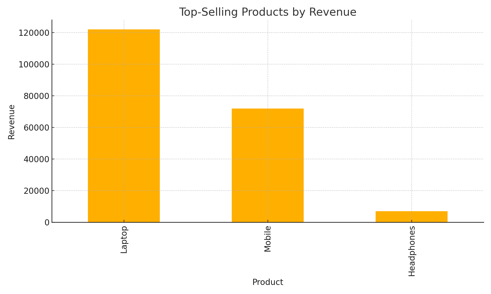
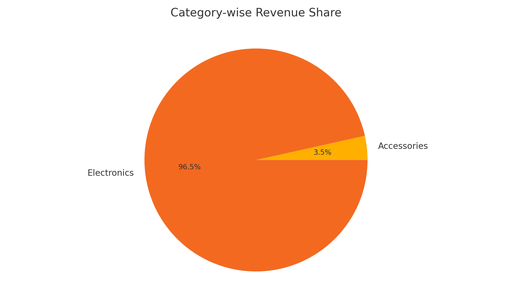
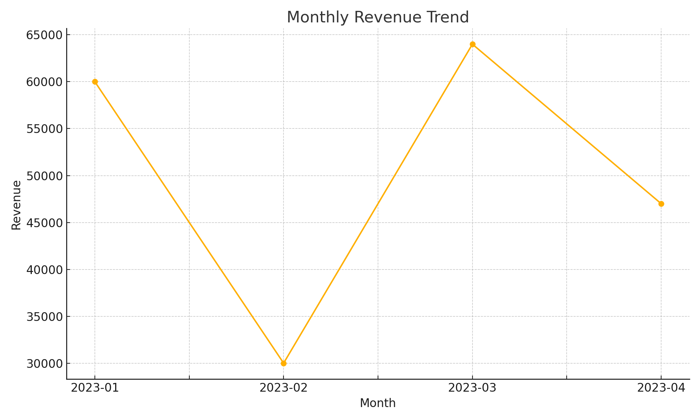

# 📊 E-commerce Sales Insights 

## 📂 Project Overview
This project is a beginner-friendly **Data Analysis Project** designed to demonstrate how sales data can be analyzed to generate business insights. Using a small e-commerce dataset, the project explores sales trends, product performance, and customer purchasing behavior.

---

## 🛠 Tools & Skills
- **Python (Pandas, Matplotlib/Seaborn)** – Data cleaning & analysis
- **Excel / SQL** – Querying & exploration
- **Power BI / Tableau** – Interactive dashboard creation
- **Skills Covered:** Data Wrangling, Aggregations, Visualization, Storytelling

---

## 📂 Dataset
**File:** `ecommerce_sales.csv`

**Columns:**
- `OrderID` → Unique order identifier
- `Customer` → Customer name
- `Product` → Product purchased
- `Category` → Product category
- `Quantity` → Units sold
- `Price` → Price per unit
- `OrderDate` → Date of order

---

## 🔍 Analysis Performed
1. **Revenue Analysis** – Total revenue generated
2. **Product Performance** – Best-selling products
3. **Category Insights** – Electronics vs Accessories sales
4. **Monthly Trend** – Sales growth across months
5. **Customer Insights** – Repeat vs one-time buyers

---

## 📊 Visualizations
- **Bar Chart:** Top-selling products
- **Pie Chart:** Category-wise revenue share
- **Line Chart:** Monthly revenue trend

(Include screenshots of Excel / Power BI / Tableau dashboards here)

---

## 🚀 How to Run the Project
1. Clone the repository:
```bash
git clone https://github.com/your-username/ecommerce-sales-insights.git
```

2. Install dependencies:
```bash
pip install pandas matplotlib seaborn
```

3. Run the analysis:
```bash
python analysis.py
```

---

## 📜 Python Script: `analysis.py`
```python
import pandas as pd
import matplotlib.pyplot as plt
import seaborn as sns

# Load dataset
df = pd.read_csv("ecommerce_sales.csv")

# Basic info
print("Dataset Info:\n", df.info())
print("\nFirst 5 Rows:\n", df.head())

# Total Revenue
df["Revenue"] = df["Quantity"] * df["Price"]
total_revenue = df["Revenue"].sum()
print("\nTotal Revenue:", total_revenue)

# Top Selling Products
product_sales = df.groupby("Product")["Revenue"].sum().sort_values(ascending=False)
print("\nTop Selling Products:\n", product_sales)

# Category-wise Revenue
category_sales = df.groupby("Category")["Revenue"].sum()
print("\nCategory-wise Revenue:\n", category_sales)

# Monthly Trend
df["OrderDate"] = pd.to_datetime(df["OrderDate"])
df["Month"] = df["OrderDate"].dt.to_period("M")
monthly_sales = df.groupby("Month")["Revenue"].sum()
print("\nMonthly Revenue:\n", monthly_sales)

# --- Visualizations ---
sns.barplot(x=product_sales.index, y=product_sales.values)
plt.title("Top Selling Products")
plt.ylabel("Revenue")
plt.show()

category_sales.plot(kind="pie", autopct='%1.1f%%')
plt.title("Category-wise Revenue Share")
plt.ylabel("")
plt.show()

monthly_sales.plot(kind="line", marker='o')
plt.title("Monthly Revenue Trend")
plt.xlabel("Month")
plt.ylabel("Revenue")
plt.show()
```

---

## Results (Charts)



Tableau #Excel #BusinessIntelligence
